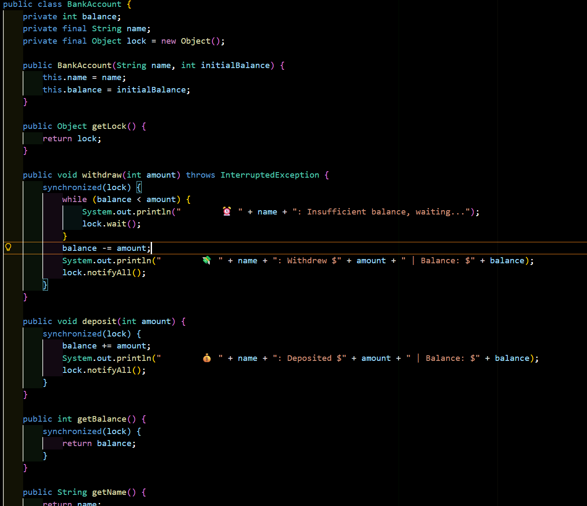
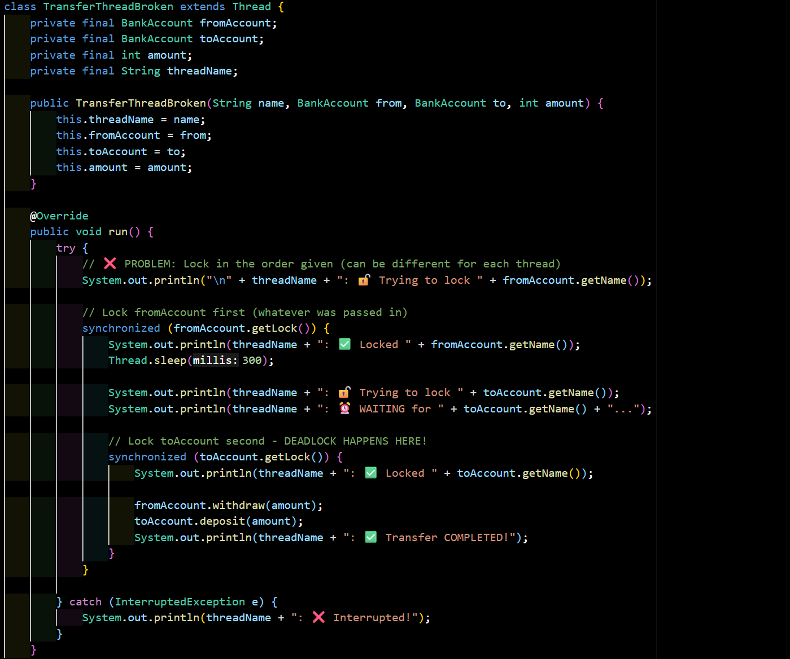
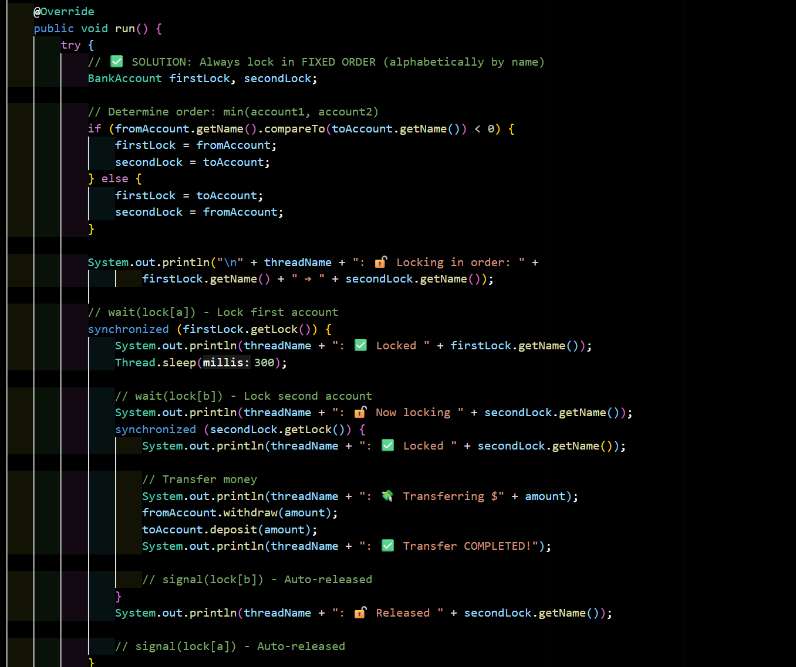
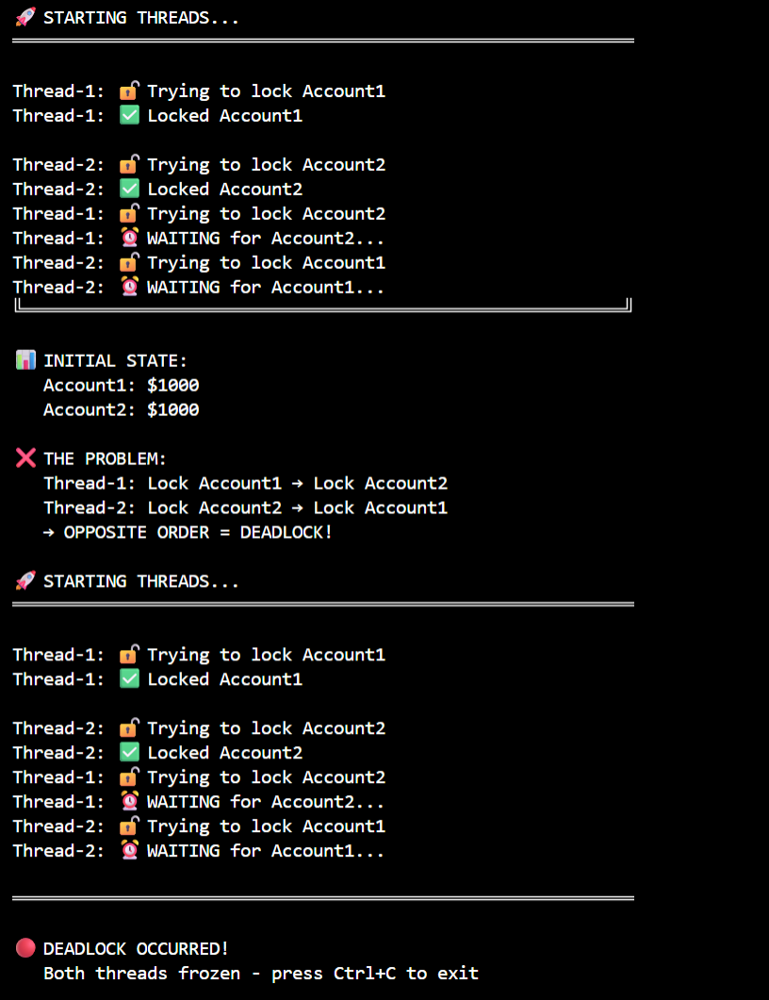
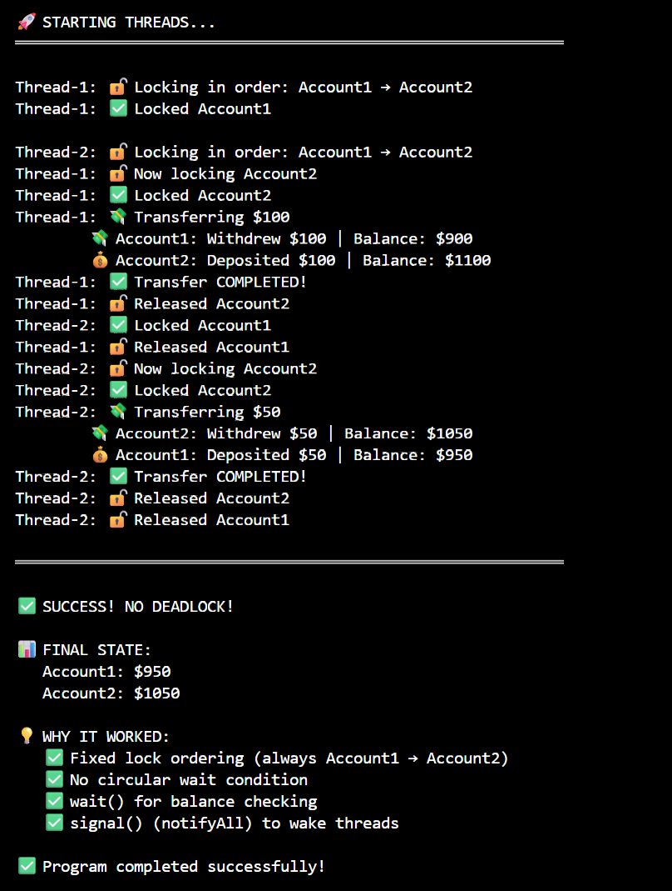

# Deadlock Simulation Report
## Bank Account Transfer Example


#### 1. BankAccount Class
```java
public class BankAccount {
    private int balance;
    private final String name;
    private final Object lock;
    
    // Methods: withdraw(), deposit(), wait(), notify()
}
```

**Features:**
- Each account has its own lock (monitor)
- Uses `wait()` to pause when balance is insufficient
- Uses `notifyAll()` to wake waiting threads after deposits
- Thread-safe operations using `synchronized`

#### 2. TransferThread Class
```java
class TransferThread extends Thread {
    private BankAccount fromAccount;
    private BankAccount toAccount;
    private int amount;
    
    public void run() {
        // Acquire locks
        // Transfer money
        // Release locks
    }
}
```

**Purpose:**
- Simulates a money transfer operation
- Acquires locks on both accounts
- Performs withdrawal and deposit
- Releases locks after completion

---

## The Problem: Deadlock Scenario

### Code Structure (DeadlockBroken.java)

```java
// Thread-1: Transfer $100 from Account1 → Account2
synchronized(account1.getLock()) {        // Lock Account1
    synchronized(account2.getLock()) {    // Lock Account2
        // Transfer money
    }
}

// Thread-2: Transfer $50 from Account2 → Account1
synchronized(account2.getLock()) {        // Lock Account2
    synchronized(account1.getLock()) {    // Lock Account1
        // Transfer money
    }
}
```

### Why Deadlock Occurs

**Timeline:**

| Time | Thread-1 | Thread-2 |
|------|----------|----------|
| T1 | 🔒 Locks Account1 | - |
| T2 | - | 🔒 Locks Account2 |
| T3 | ⏰ Waits for Account2 | - |
| T4 | - | ⏰ Waits for Account1 |
| T5 | **DEADLOCK** | **DEADLOCK** |

**Circular Wait:**
```
Thread-1 holds Account1 → needs Account2
    ↓                            ↑
    ↓                            ↑
Thread-2 holds Account2 → needs Account1
```

### Sample Output (Broken Version)

```
🚀 STARTING THREADS...

Thread-1: 🔓 Trying to lock Account1
Thread-1: ✅ Locked Account1
Thread-1: ⚙️ Processing...

Thread-2: 🔓 Trying to lock Account2
Thread-2: ✅ Locked Account2
Thread-2: ⚙️ Processing...

Thread-1: 🔓 Trying to lock Account2
Thread-1: ⏰ WAITING for Account2...

Thread-2: 🔓 Trying to lock Account1
Thread-2: ⏰ WAITING for Account1...

🔴 DEADLOCK OCCURRED!
Program frozen - press Ctrl+C to exit
```

---

## The Solution: Fixed Lock Ordering

### Cooperating Processes Approach

**Key Principle:** Establish a **fixed ordering** for acquiring locks. All threads must acquire locks in the **same order**.

### Implementation Strategy

```java
// Determine lock order BEFORE acquiring
int a = min(account1, account2);  // Always get smaller first
int b = max(account1, account2);  // Then get larger

// Acquire in fixed order
wait(lock[a]);    // Lock 'a' first
wait(lock[b]);    // Lock 'b' second

// Transfer money
balance[fromAccount] -= amount;
balance[toAccount] += amount;

// Release in reverse order
signal(lock[b]);  // Release 'b' first
signal(lock[a]);  // Release 'a' second
```

### Code Structure (DeadlockFixed.java)

```java
// BOTH threads determine order first
BankAccount firstLock, secondLock;

if (fromAccount.getName().compareTo(toAccount.getName()) < 0) {
    firstLock = fromAccount;
    secondLock = toAccount;
} else {
    firstLock = toAccount;
    secondLock = fromAccount;
}

// Now lock in same order
synchronized(firstLock.getLock()) {
    synchronized(secondLock.getLock()) {
        // Transfer money safely
    }
}
```

### Why This Works

**Timeline with Fixed Ordering:**

| Time | Thread-1 | Thread-2 |
|------|----------|----------|
| T1 | 🔒 Locks Account1 | ⏰ Waits for Account1 |
| T2 | 🔒 Locks Account2 | ⏰ Still waiting... |
| T3 | ✅ Completes transfer | ⏰ Still waiting... |
| T4 | 🔓 Releases locks | - |
| T5 | - | 🔒 Locks Account1 |
| T6 | - | 🔒 Locks Account2 |
| T7 | - | ✅ Completes transfer |

**No Circular Wait:**
```
Thread-1: Account1 → Account2 ✅
Thread-2: Account1 → Account2 ✅
    (Same order - no circle!)
```

### Sample Output (Fixed Version)

```
🚀 STARTING THREADS...

Thread-1: 🔓 Locking in order: Account1 → Account2
Thread-1: ✅ Locked Account1
Thread-1: 🔓 Now locking Account2
Thread-1: ✅ Locked Account2
Thread-1: 💸 Transferring $100
Thread-1: ✅ Transfer COMPLETED!
Thread-1: 🔓 Released Account2
Thread-1: 🔓 Released Account1

Thread-2: 🔓 Locking in order: Account1 → Account2
Thread-2: ✅ Locked Account1
Thread-2: 🔓 Now locking Account2
Thread-2: ✅ Locked Account2
Thread-2: 💸 Transferring $50
Thread-2: ✅ Transfer COMPLETED!
Thread-2: 🔓 Released Account2
Thread-2: 🔓 Released Account1

✅ SUCCESS! NO DEADLOCK!
```

---

## Implementation Details

### Synchronization Mechanisms Used

#### 1. **synchronized Keyword**
```java
synchronized(lock) {
    // Critical section
    // Lock automatically released at end
}
```
- Provides mutual exclusion
- Ensures only one thread can execute critical section
- Automatic lock release (even on exceptions)

#### 2. **wait() Method**
```java
while (balance < amount) {
    lock.wait();  // Release lock and sleep
}
```
- Thread releases lock and goes to sleep
- Waits until another thread calls `notify()`
- Automatically re-acquires lock when awakened
- Must be called inside `synchronized` block

#### 3. **notifyAll() Method**
```java
balance += amount;
lock.notifyAll();  // Wake all waiting threads
```
- Wakes up all threads waiting on this lock
- Threads compete to re-acquire lock
- Should be called inside `synchronized` block

### Lock Ordering Algorithm

```java
// Compare account names alphabetically
if (fromAccount.getName().compareTo(toAccount.getName()) < 0) {
    firstLock = fromAccount;
    secondLock = toAccount;
} else {
    firstLock = toAccount;
    secondLock = fromAccount;
}
```

**Alternative methods:**
- Compare by hash code: `System.identityHashCode(account)`
- Assign unique IDs at creation
- Use natural ordering of account numbers

---

## Results and Analysis

### Test Cases

#### Test Case 1: Broken Version (Deadlock)

**Input:**
- Account1: $1000
- Account2: $1000
- Thread-1: Transfer $100 from Account1 → Account2
- Thread-2: Transfer $50 from Account2 → Account1

**Expected Result:** Deadlock occurs

**Actual Result:**
```
Account1: $1000 (unchanged)
Account2: $1000 (unchanged)
Status: DEADLOCK - Program frozen
```

**Analysis:** Both threads acquired their first lock successfully but got stuck waiting for the second lock, creating a circular wait condition.

---

#### Test Case 2: Fixed Version (No Deadlock)

**Input:**
- Account1: $1000
- Account2: $1000
- Thread-1: Transfer $100 from Account1 → Account2
- Thread-2: Transfer $50 from Account2 → Account1

**Expected Result:** Both transfers complete successfully

**Actual Result:**
```
Account1: $950 (initial: $1000, -$100, +$50)
Account2: $1050 (initial: $1000, +$100, -$50)
Status: SUCCESS - No deadlock
```

**Analysis:** Fixed lock ordering eliminated circular wait. Thread-2 waited for Thread-1 to complete, then executed successfully.

---

### Performance Comparison

| Metric | Broken Version | Fixed Version |
|--------|---------------|---------------|
| Execution Time | ∞ (frozen) | ~1 second |
| Transfers Completed | 0 | 2 |
| CPU Usage | ~0% (blocked) | Normal |
| Thread State | BLOCKED | RUNNABLE → TERMINATED |
| Final Balances | Unchanged | Correctly updated |

---

### File Structure
```
project/
├── BankAccount.java          (Shared account class)
├── DeadlockBroken.java       (Demonstrates deadlock)
└── DeadlockFixed.java        (Demonstrates solution)
```

### How to Run

```bash
# Compile all files
javac BankAccount.java
javac DeadlockBroken.java
javac DeadlockFixed.java

# Run broken version (will deadlock)
java DeadlockBroken

# Run fixed version (completes successfully)
java DeadlockFixed
```
**BankAccount**


**DeadlockBroken**



**DeadlockFixed**


**Output**




