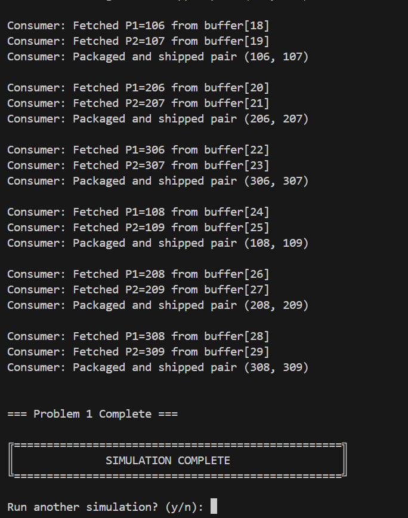
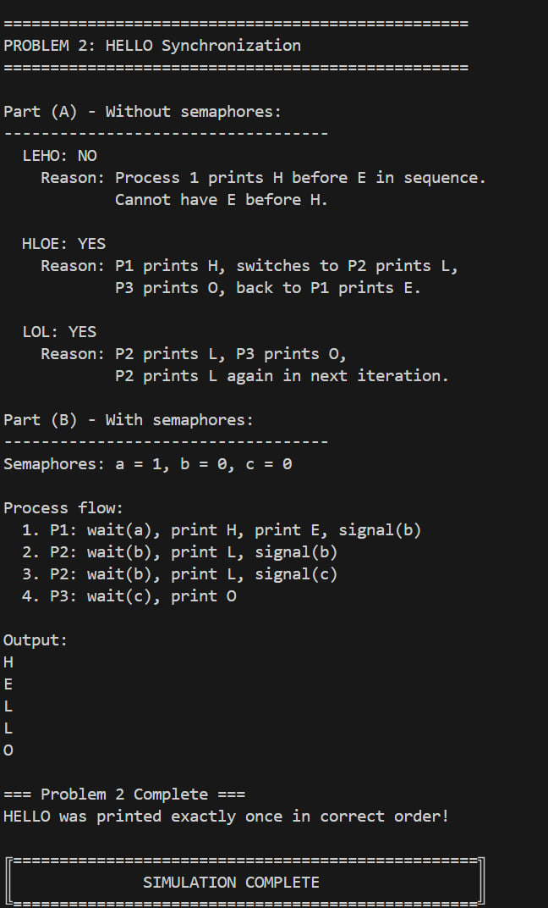

# Semaphore Synchronization Problems
## Operating Systems Assignment

---

**Name:** PHE RITHIKA  
**Student ID:** e20220245  
**Group:** GIC-I4-A  
**Date:** January 6, 2025

---

## Table of Contents
1. [Problem 1: Producer-Consumer Solution](#problem-1-producer-consumer)
2. [Problem 2: HELLO Synchronization](#problem-2-hello-synchronization)
3. [GitHub Repository](#github-repository)
4. [Compilation and Execution](#compilation-and-execution)

---

## Problem 1: Producer-Consumer

### Problem Description
Multiple producers create particle pairs that are placed in a shared buffer. A consumer fetches these pairs and packages them. The synchronization ensures:
- Pairs are stored consecutively in the buffer
- Buffer capacity (100 particles or 50 pairs) is not exceeded
- Consumer only fetches when at least one complete pair is available
- Multiple producers can work simultaneously without conflicts

### Semaphore Design

I used **3 semaphores** to solve this problem:

| Semaphore | Initial Value | Purpose |
|-----------|---------------|---------|
| `empty`   | 50           | Tracks available pair slots in buffer (100 particles ÷ 2) |
| `full`    | 0            | Tracks complete pairs ready for consumption |
| `mutex`   | 1            | Ensures mutual exclusion for buffer access |

### Algorithm Explanation

**Producer Algorithm:**
```
1. Produce pair (P1, P2)
2. wait(empty)     // Wait for space for one pair
3. wait(mutex)     // Enter critical section
4. Place P1 in buffer
5. Place P2 in buffer (consecutive location)
6. post(mutex)     // Exit critical section
7. post(full)      // Signal one pair is ready
```

**Consumer Algorithm:**
```
1. wait(full)      // Wait for at least one complete pair
2. wait(mutex)     // Enter critical section
3. Fetch P1 from buffer
4. Fetch P2 from buffer
5. post(mutex)     // Exit critical section
6. post(empty)     // Signal space for one pair is available
7. Package and ship
```

### Why This Solution Works

1. **Prevents Buffer Overflow:** The `empty` semaphore ensures producers wait when buffer is full (Rule 3)
2. **Maintains Consecutive Pairs:** The `mutex` ensures atomic placement of both particles (Rule 2)
3. **Prevents Buffer Underflow:** The `full` semaphore ensures consumer waits when fewer than 2 particles available (Rule 4)
4. **Handles Multiple Producers:** The `mutex` prevents race conditions between concurrent producers (Rule 1)

### Execution Result



**Key Observations from Output:**
- Multiple producers (Producer 1, 2, 3) create pairs concurrently
- Pairs are placed in consecutive buffer locations (e.g., buffer[18] and buffer[19])
- Consumer fetches and packages pairs in order
- No buffer overflow or underflow occurs
- Synchronization works correctly with 3 concurrent producers

---

## Problem 2: HELLO Synchronization

### Part (A): Analysis Without Semaphores

#### LEHO: **NO**
**Reasoning:** Process 1 prints "H" before "E" in its execution sequence. Since Process 1 executes these statements sequentially, we cannot have "E" appear before "H" in the output. Therefore, the sequence "LEHO" is impossible.

#### HLOE: **YES**
**Reasoning:** This sequence is possible through the following interleaving:
1. Process 1 executes and prints "H"
2. Process 1 is preempted (context switch)
3. Process 2 executes and prints "L"
4. Process 3 executes and prints "O"
5. Process 1 resumes and prints "E"

This demonstrates how process scheduling can create this specific output sequence.

#### LOL: **YES**
**Reasoning:** This sequence is possible because:
1. Process 2 executes and prints "L"
2. Process 3 executes and prints "O"
3. Process 2 executes again (next iteration) and prints "L"

Since both Process 2 and Process 3 are in infinite loops, this sequence can occur repeatedly.

### Part (B): Solution With Semaphores

To ensure "HELLO" is printed exactly once in the correct order, I used **3 semaphores**:

| Semaphore | Initial Value | Purpose |
|-----------|---------------|---------|
| `a`       | 1            | Allows Process 1 to start immediately |
| `b`       | 0            | Process 2 must wait for Process 1 |
| `c`       | 0            | Process 3 must wait for Process 2 |

### Process Algorithms

**Process 1:**
```python
wait(a)        # Wait for semaphore a (initially available)
print("H")     # Print H
print("E")     # Print E
signal(b)      # Give permission to Process 2
```

**Process 2:**
```python
wait(b)        # Wait for permission from Process 1
print("L")     # Print first L
signal(b)      # Signal self for second L

wait(b)        # Wait for own signal
print("L")     # Print second L
signal(c)      # Give permission to Process 3
```

**Process 3:**
```python
wait(c)        # Wait for permission from Process 2
print("O")     # Print O
```

### Execution Flow

```
Initial state: a=1, b=0, c=0

Step 1: Process 1 executes
  - wait(a): a becomes 0, Process 1 proceeds
  - prints "H"
  - prints "E"
  - signal(b): b becomes 1
  
Step 2: Process 2 executes (first L)
  - wait(b): b becomes 0, Process 2 proceeds
  - prints "L"
  - signal(b): b becomes 1

Step 3: Process 2 continues (second L)
  - wait(b): b becomes 0, Process 2 proceeds
  - prints "L"
  - signal(c): c becomes 1

Step 4: Process 3 executes
  - wait(c): c becomes 0, Process 3 proceeds
  - prints "O"

Result: "HELLO" printed exactly once
```

### Execution Result



**Key Observations from Output:**
- Part (A) correctly identifies which sequences are possible without semaphores
- Part (B) demonstrates the semaphore-based solution
- Output shows each letter (H, E, L, L, O) printed on separate lines
- "HELLO" is printed exactly once in the correct order
- No repetition or incorrect sequencing occurs

---

## GitHub Repository

**Repository URL:** `https://github.com/Rithika11-ui/os.git`
Branch : Semaphore

---

## Compilation and Execution

### Running the Program:

**Option 1: Run all problems with menu**
```bash
python main.py
```

**Option 2: Run individual problems**
```bash
# Run Problem 1 only
python problem1.py

# Run Problem 2 only
python problem2.py
```

### Expected Behavior:
1. When running `main.py`, a menu appears with 4 options
2. Select option 3 to run both problems sequentially
3. Problem 1 demonstrates producer-consumer synchronization
4. Problem 2 demonstrates process coordination to print "HELLO"
5. Both problems complete successfully without deadlock or race conditions

---

## Conclusion

This assignment demonstrates the effective use of semaphores for process synchronization:

1. **Problem 1** shows how counting semaphores (`empty`, `full`) track resources and a binary semaphore (`mutex`) provides mutual exclusion in a producer-consumer scenario.

2. **Problem 2** demonstrates how semaphores can enforce strict execution ordering among multiple processes to achieve a specific output sequence.

Both solutions use the minimum number of semaphores required and follow best practices for avoiding deadlock and ensuring proper synchronization.

---

**Submitted by:** PHE RITHIKA (e20220245)  
**Group:** GIC-I4-A  
**Date:** January 6, 2025