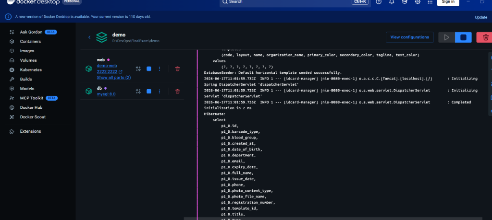
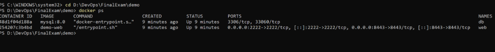
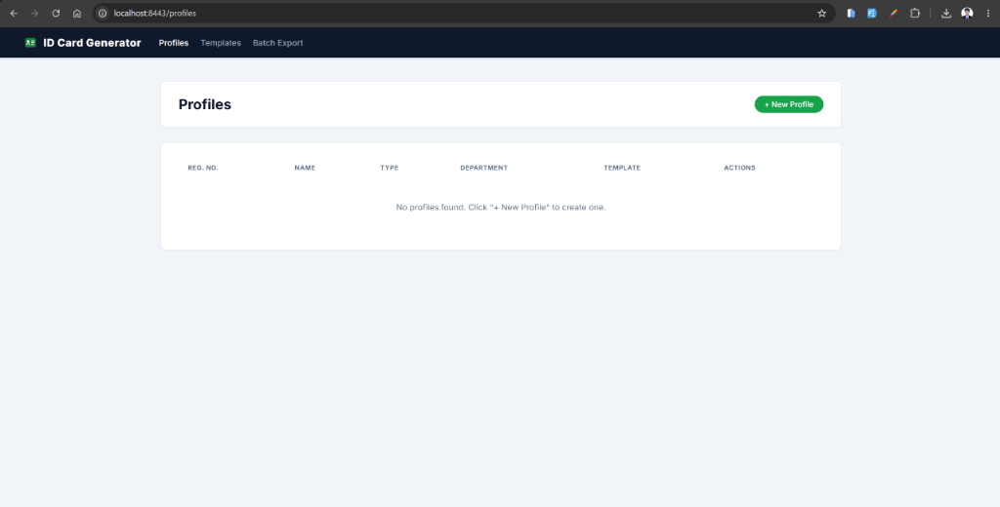
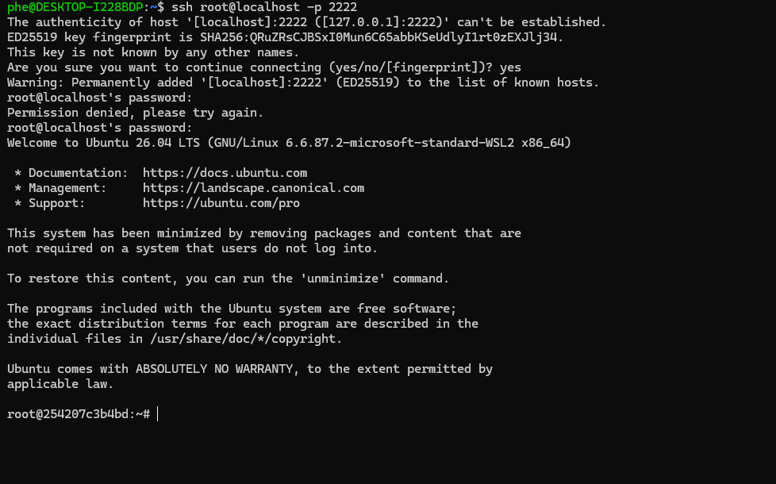
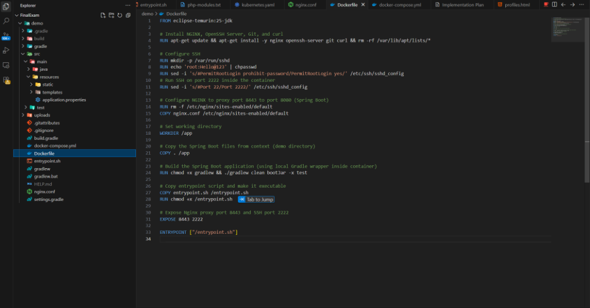
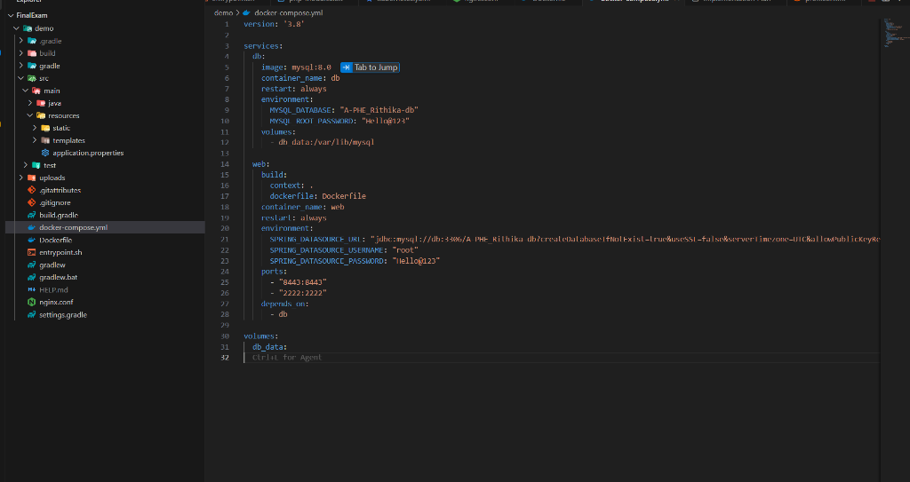
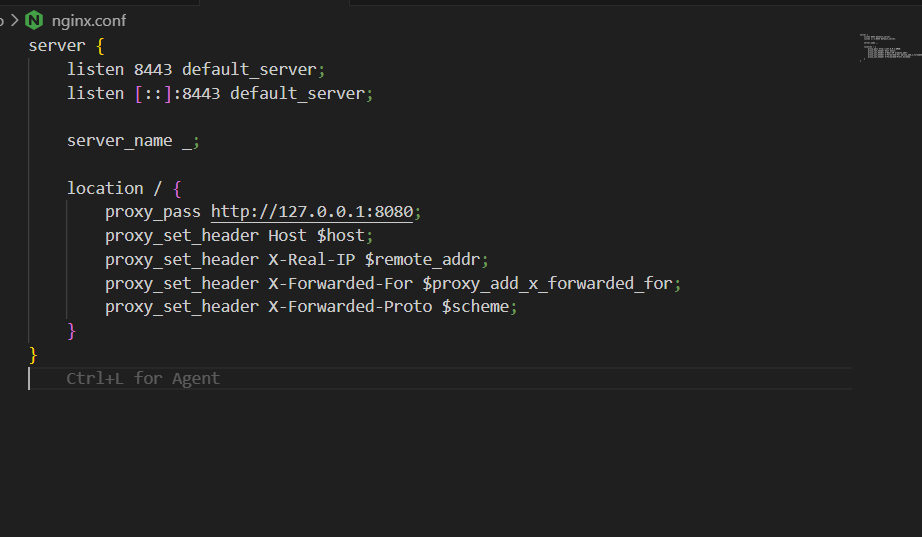

# Final Exam - DevOps Submission (Task 2)

## Student Information
* **Name**: PHE RITHIKA
* **ID**: e20220245
* **Class**: GIC-I4-A
* **Group**: A

---

## Task 2: Docker Compose Multi-Container Deployment

I have containerized the Spring Boot application and configured the MySQL database using Docker Compose (Choice A) as specified in the exam requirements.

Below are the screenshots and descriptions demonstrating the successful implementation and verification of this task.

---

### 1. Docker Desktop Overview
This screenshot shows the **`demo`** multi-container stack running on Docker Desktop. Both the `web` container (hosting Nginx, OpenSSH, and Spring Boot) and the `db` container (hosting MySQL) are running successfully in harmony.

---

### 2. Docker Compose Port Expositions
The running containers list shows that port `2222` (SSH) and port `8443` (Nginx proxy) are successfully exposed and mapped to the host system.

---

### 3. Nginx Reverse Proxy Web Access
The web application is successfully accessed in the browser at `http://localhost:8443/profiles` via the Nginx proxy container, which forwards traffic to Spring Boot running internally on port `8080`.

---

### 4. SSH Login Verification
I verified SSH connectivity to the container by running `ssh root@localhost -p 2222`. As shown below, login succeeded using the password `Hello@123`.

---

### 5. MySQL Database Verification
I verified the database name `A-PHE_Rithika-db` (Group: A, Name: PHE Rithika) and confirmed that the Spring Boot database seeder successfully initialized the `profiles` and `templates` tables inside the MySQL container.

---

### 6. Docker Compose Configuration file
This shows the `docker-compose.yml` file in the project workspace defining the service boundaries, dependencies, and environment variables.

---

### 7. Nginx Proxy Configuration File
This shows the `nginx.conf` configuration file in the project workspace directing traffic from proxy port `8443` to the internal Spring Boot port `8080`.

---

## Repository Details
* **Repository URL**: https://github.com/Rithika11-ui/I4A-FirstProjectJenkins.git
* **Branch**: `finalexam`
