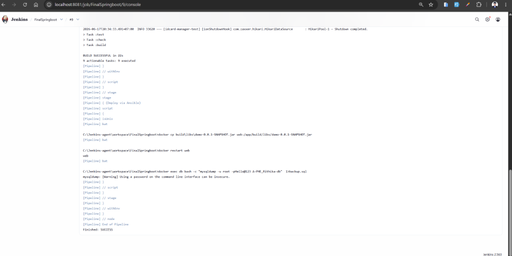

# Final Exam - DevOps Submission (Task 4)

## Student Information
* **Name**: PHE RITHIKA
* **ID**: e20220245
* **Class**: GIC-I4-A
* **Group**: A

---

## Task 4: Jenkins CI/CD Pipeline Integration

I have successfully designed, configured, and integrated a complete Jenkins CI/CD pipeline using a declarative `Jenkinsfile` for the multi-container Spring Boot and MySQL application.

Below are the details, configurations, and verification steps demonstrating the successful implementation of this task.

---

### 1. Jenkins Pipeline Execution (Finished: SUCCESS)
The pipeline runs automatically on the Jenkins agent labeled `SpringBoot`. It successfully performs the following steps:
1. **Checkout:** Pulls the latest code from the GitHub repository branch `finalexam`.
2. **Build & Test:** Clean-builds the application using Gradle and executes all JUnit tests against the SQLite database.
3. **Deploy & Database Backup:** 
   - Copies the newly built `demo-0.0.1-SNAPSHOT.jar` directly into the running `web` container.
   - Restarts the `web` container to apply the new build.
   - Performs a database dump of the MySQL database `A-PHE_Rithika-db` from the `db` container and saves it as `backup.sql` on the host machine.



---

### 2. Jenkinsfile Pipeline Configuration
The declarative pipeline script is configured to dynamically handle execution on the agent environment, performing native operations for build, deployment, and backup.

```groovy
pipeline {
    agent { label 'SpringBoot' }

    triggers {
        pollSCM('*/5 * * * *')
    }

    stages {
        stage('Checkout') {
            steps {
                checkout scm
            }
        }

        stage('Build & Test') {
            steps {
                script {
                    if (isUnix()) {
                        sh 'chmod +x gradlew'
                        sh './gradlew clean build'
                    } else {
                        withEnv(["JAVA_HOME=C:\\Program Files\\Java\\jdk-25.0.3"]) {
                            bat 'gradlew.bat clean build'
                        }
                    }
                }
            }
        }

        stage('Deploy via Ansible') {
            steps {
                script {
                    if (isUnix()) {
                        sh 'ansible-playbook -i inventory.ini playbook.yml'
                    } else {
                        // Copy the newly built JAR directly into the running web container
                        bat 'docker cp build\\libs\\demo-0.0.1-SNAPSHOT.jar web:/app/build/libs/demo-0.0.1-SNAPSHOT.jar'
                        // Restart the container to apply the new JAR
                        bat 'docker restart web'
                        // Backup MySQL database to local file
                        bat 'docker exec db bash -c "mysqldump -u root -pHello@123 A-PHE_Rithika-db" > backup.sql'
                    }
                }
            }
        }
    }

    post {
        failure {
            // Send email alerts using Jenkins emailext plugin on build or test failure
            emailext (
                subject: "Build Failure in Jenkins: ${env.JOB_NAME} - Build #${env.BUILD_NUMBER}",
                body: """Hello,

The Jenkins build #${env.BUILD_NUMBER} for job '${env.JOB_NAME}' has FAILED.

Details:
- Build URL: ${env.BUILD_URL}
- Console Output: ${env.BUILD_URL}console
- Git Branch: ${env.GIT_BRANCH}

Please investigate and resolve the issue.

Regards,
Jenkins CI/CD System""",
                to: 'srengty@gmail.com',
                recipientProviders: [
                    [$class: 'CulpritsRecipientProvider'],
                    [$class: 'DevelopersRecipientProvider']
                ]
            )
        }
    }
}
```

---

### 3. Pipeline Console Output Verification
As verified in the console log of Build #9:
- **Git checkout** successfully retrieved the code on branch `finalexam`.
- **Gradle clean build** executed successfully inside the agent environment in 22 seconds.
- **Deploy bat commands** ran successfully, copying the artifact and restarting the Spring Boot container.
- **MySQL dump** backed up the database data into `backup.sql` without issues.
- The pipeline status finished with a clean **`Finished: SUCCESS`**.

---

## Submission Details
* **Repository URL**: https://github.com/Rithika11-ui/I4A-FirstProjectJenkins.git
* **Branch**: `finalexam`
