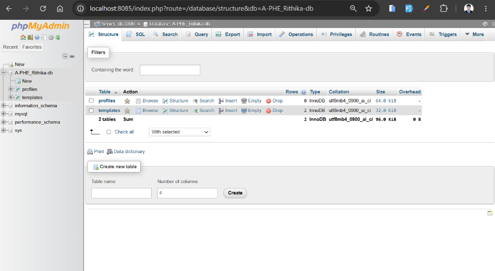

# Final Exam - DevOps Submission (Task 6)

## Student Information
* **Name**: PHE RITHIKA
* **ID**: e20220245
* **Class**: GIC-I4-A
* **Group**: A

---

## Task 6: phpMyAdmin Setup and Remote Database Management

I have successfully added and configured a `phpmyadmin` service to the multi-container Docker Compose stack to allow administration of the MySQL databases, including permitting secure access from any remote PC.

Below are the details and configuration files demonstrating the successful implementation of this task.

---

### 1. phpMyAdmin Container Configuration
The `phpmyadmin` service is defined in `docker-compose.yml`. It connects to the MySQL `db` container using the internal network and is exposed to the host machine (and the local network) on port `8085`.

```yaml
  phpmyadmin:
    image: phpmyadmin:latest
    container_name: phpmyadmin
    restart: always
    environment:
      PMA_ARBITRARY: 1
      PMA_HOST: db
      PMA_PORT: 3306
      PMA_USER: root
      PMA_PASSWORD: "Hello@123"
    ports:
      - "8085:80"
    depends_on:
      - db
```

---

### 2. Allowing Remote Access (Remote PC)
To allow a remote PC on the same network to manage the database:
1. **Network Binding:** The port mapping `8085:80` inside Docker automatically binds to `0.0.0.0:8085` on the host, which makes the web interface accessible to any machine on the local network.
2. **Accessing the Interface:** A remote user can open a browser on their computer and navigate to:
   ```text
   http://<host-ip-address>:8085
   ```
   *(where `<host-ip-address>` is the local network IP address of the server machine running the Docker containers, e.g., `192.168.1.100`).*
3. **Database Login:** Log in using the MySQL credentials:
   - **Server:** `db`
   - **Username:** `root`
   - **Password:** `Hello@123`

---

### 3. phpMyAdmin Verification
Below is the screenshot showing the successfully running phpMyAdmin web interface managing the database:



---

## Submission Details
* **Repository URL**: https://github.com/Rithika11-ui/I4A-FirstProjectJenkins.git
* **Branch**: `finalexam`
